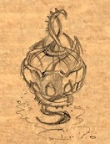

<html>

<b>The Broken Lanthorn</b>

<b>Quest mod for BG2EE or EET</b>

This mod contains the restoration of a quest line that was omitted from the original game. It starts after Bodhi's defeat and adds content for the three unused Tethir areas.

When you return the Lanthorn to Elhan the sages will discover that some lenses are missing and the device is not focussed to reveal Suldanessalar. The party is thus tasked to find the missing pieces.

New encounters are added to the empty areas Small Teeth, Northern Forest and Tethir Forest plus some other areas you need to explore for the quests.

As far as they still existed, the mod uses fragmented files from the original game that were apparently planned for a respective quest. Anyway, there is no evidence that my interpretation of those leftovers comes even close to the original idea.
 
&nbsp;

&nbsp;

</body>

</html>
